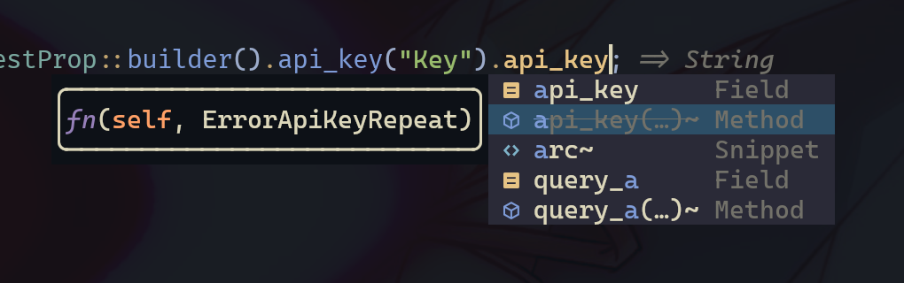

+++
title = 'Rust Builder pattern 学习总结'
date = '2023-02-01'
tag = ['rust', 'builder pattern']
author = 'sh1marin'
+++

过年期间用 Rust 写了个 DeepL API 的库，学了不少 Rust Builder Pattern
的知识，借此来水一篇新的博客。

> * 本文的参考示例代码：[Rust Playground](https://play.rust-lang.org/?version=stable&mode=debug&edition=2021&gist=07343970399f268087aecae73906f947)
> * DeepL 库源码： [deepl-rs](https://github.com/Avimitin/deepl-rs)
> * 本文将提到的 Async Builder 相关代码： [deepl-rs #12](https://github.com/Avimitin/deepl-rs/pull/12/files)

---

在写 HTTP 请求库的时候，通常需要给开发者一个用来生成请求内容的结构体。
请求内容会有必填的属性和可选的属性，且有些请求会有大量的属性值可填，

简单的用一个函数来生成肯定是不现实的，函数签名太长，且多个可选的内容要
开发者不断手写 `None`。

```rust
struct RequestProp {
    api_key: String,
    query_a: i32,
    query_b: Option<String>,
}

impl RequestProp {
    fn new(api_key: String,
           query_a: i32,
           query_b: Option<String>
    {
        // ....
    }
}

let prop = RequestProp::new("key", 1, None)
```

builder pattern 的概念非常符合这个场景。
其需要创建一个辅助结构体类型，
通过依次调用这个结构体相关的函数，构造出最终的需要的实例。
同时可以利用 `self`, `&mut self` 的语言特性来实现链式调用。

```rust
#[derive(Default)]
struct RequestPropBuilder {
    api_key: String,
    query_a: i32,
    query_b: Option<String>,
}

impl RequestPropBuilder {
    fn new() -> Self {
        Self::default()
    }

    fn api_key(&mut self, key: &str) -> &mut Self {
        self.api_key = key.to_string();

        self
    }

    fn query_a(&mut self, a: i32) -> &mut Self {
        self.query_a = a;

        self
    }

    fn query_b(&mut self, b: String) -> &mut Self {
        self.query_b = Some(b);

        self
    }

    fn build(self) -> RequestProp {
        RequestProp {
            api_key: self.api_key,
            query_a: self.query_a,
            query_b: self.query_b,
        }
    }
}
```

这里可以给原来的结构体加一个 `builder()` 函数来方便开发者调用：

```rust
impl RequestProp {
    fn builder() -> RequestPropBuilder {
        RequestPropBuilder::new()
    }
}
```

于是就可以有下面这种写法：

```rust
let prop = RequestProp::builder()
                .api_key("key")
                .query_a(13)
                .query_b("FooBarBaz")
                .build();
```

不需要设置可选 `query_b` 的时候就不再需要显示的声明了

```rust
let prop: RequestProp = RequestProp::builder()
                            .api_key("key")
                            .query_a(13)
                            .build();
```

这样也有一个问题。`query_a` 因为是必填的值，类型没有设计成 `Option`，
但因为 `derive` 了 `Default` trait，这里即使开发者不设置值也能正常编译，
程序会不符合预期行为地运行。

借助 Rust 强大的类型系统，我们可以在编译期检查 builder 的值。

在实现之前，首先需要理解 Rust 的几个特性：

1. 假设有一个结构体
`B`，其持有一个的泛型属性值，那么对于两个不同的*具体类型* T 和 F，
`B<T>` 和 `B<F>` 不是同一个类型。对于两个不同类型的函数调用
也是指向不同地址的。意味着，假设 `B<T>` 和 `B<F>` 都有函数
`fn exec()`，`B::<T>::exec()` 和 `B::<F>::exec()` 调用的不是同一个函数。
2. `()` 是一个特殊的类型，Zero Sized Types (ZSTs)，它是一个空的 Tuple，
Rust 不会为它分配内存。包括像没有属性的结构体 `struct Nothing;` 这样
的声明也不会有内存分配。

利用上面的特性，我们可以构造一个泛型 builder，初始化时设置那些*必需*的
属性类型为 `()`，给这些带有 `()` 类型的 builder 都实现一个会编译警告
的 `build()` 函数，只给完整设置值的 builder 实现正确的 `build()` 函数。

```rust
struct ErrorMissingField;
struct ErrorRepeatingField;

struct Foo {
    a: i32
}

struct Builder<T> {
    a: T,
}

impl Builder<()> {
    fn a(self, a: i32) -> Builder<i32> {
        Builder { a }
    }

    #[deprecated(note = "Missing required field `a`")]
    fn build(self, _: ErrorMissingField) {}
}

impl Builder<i32> {
    #[deprecated(note = "Repeating field `a`")]
    fn a(self, _: ErrorRepeatingField) {}

    fn build(self) -> Foo {
        Foo {
            a: self.a,
        }
    }
}

impl Foo {
    fn builder() -> Builder<()> {
        Builder {
            a: ()
        }
    }
}
```

这个实现使得调用 `Foo::builder()` 返回的 `Builder<()>` 类型
拥有一个会在编译期产生警告的 `build()` 函数，当且仅当开发者调用
拥有类型 `Builder<i32>` 的实例后，才有不会编译警告的 `build()`
函数提供。

提供上面的代码给其他开发者之后，当开发者没有设置 `a` 的值
就调用 `build()` 函数时，rustc 就会警告 `deprecated` 属性里
设置的信息。但只是警告往往也没办法拦住他们错误的行为，所以
在库里设置一些 `private` 的 ZST 结构体作为参数接收。
下游开发者无法引入并新建这些结构体，于是没办法往这些函数里
传参，我们就能在编译期阻止下游开发者错误的实现。

利用这个实现，也可以给已经设置过的属性生成一个错误的 setter 函数。
如果开发者的编辑器支持，他甚至可以直接在补全时纠正自己的错误。



> Neovim 的 nvim-cmp 插件可以在补全菜单为 deprecated 函数显示删除线效果

有了 Builder 之后，创建复杂的请求内容就变得更加轻松且直观了。
但仍旧有一个问题：对于简单的请求内容而言，代码量反而增加了。

```rust
// Normal
let response = api.request("Key", "Query").send().await;

// Builder
let prop = RequestProp::builder().api_key("Key").query("Query").build();
let response = api.request(&prop).send().await;
```

这个问题其实可以抛给下游的开发者，让他们自己用一个函数来包住整个过程，
但我学习到有另一种更加“魔法”的实现方式，
可以用一条链式调用完成整个 “构建” “传参” “请求” 的过程，减少下游开发的代码量。

这个“魔法”的实现需要靠实现 [`IntoFuture`](https://doc.rust-lang.org/std/future/trait.IntoFuture.html)
trait 来达成。Rust 的 `.await` 关键字提供的语法糖可以自动调用
`IntoFuture::into_future` 并 poll 这个 future 直到完成。
于是利用这个特性，我们可以将 builder 的构造函数和请求函数
都“藏”进 .await 调用里。

想要实现这个特性，Builder 需要额外接收一个发送请求的对象，比如 `reqwest::Client`，
方便我们在调用 await 时直接发送请求。

```rust
struct Builder<T> {
    client: Client,
    field: T,
}

struct Response {
    msg: String,
}

type BoxedFuture<T> = std::pin::Pin<Box<dyn Future<Output = T> + Send + 'static>>

impl IntoFuture for Builder<i32> {
    type Output = Response;
    type IntoFuture = BoxedFuture<Self::Output>;

    fn into_future(self) -> Self::IntoFuture {
        let client = self.client.clone();
        let prop = self.build();

        let future = async move {
            let response = client.post("https://example.com", prop).await;

            response.unwrap()
        };

        Box::pin(future)
    }
}
```

想要轮询一个 Future 实例，我们需要将这个实例的内存地址用 `std::pin::Pin`
固定住，防止在轮询过程中随着 Future 的移动导致指针引用失效的情况。

借由 `IntoFuture` trait 的实现，下游开发可以保证有 builder pattern 的写法
下，还能保持在简单请求时代码的精简：

```rust
struct Api {
    client: Client,
}

impl Api {
    fn get_something(&self, a: &str) -> Builder<String> {
        Foo::builder(self.client.clone()) // <- 把 Api 持有的 Client 传递给 Builder
            .a(a)
    }
}

let response = api.get_something("a").await;

let response = api.get_something("a")
                    .optional_1(123)
                    .optional_2(456)
                    .await;
```

当下游开发只需要填写必要值时，它可以只传递这些必要值进 builder 就直接
调用 .await 来获取返回值。而当他需要构建复杂的请求参数时，因为 `api.get_something`
返回了 builder，它可以继续链式调用构造请求，完成构造后再调用 await 发送请求。
