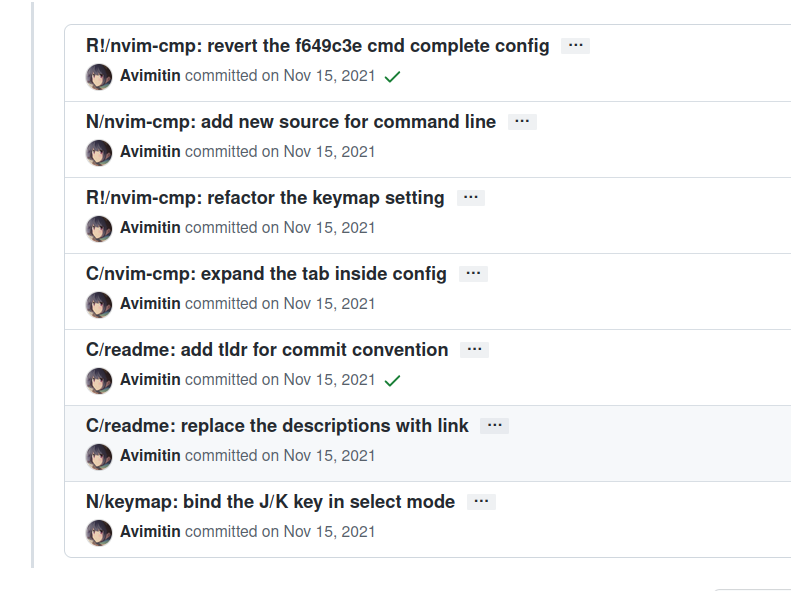
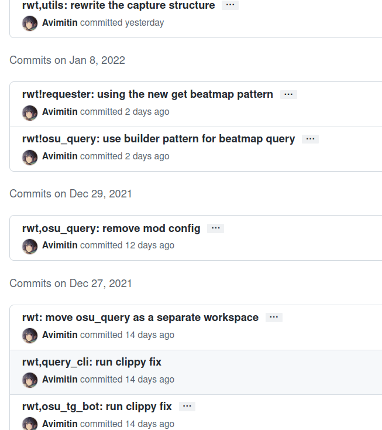

+++
title = '对 commit title 的一些思考'
date  = '2022-01-10'
tag = ['git', 'commit']
author = 'Avimitin'
+++
## 前言

最近对自己的 [commit convention](https://commit-convention.sh1mar.in/)
看得有点烦躁了。
我觉得自己又再次陷入了用一堆问题来解决另一堆问题的困境。

先简单讲讲具体发生了一些什么事情。
以前我一直在用 Angular 的那一套 commit convention。
但是某天当我在写 title 的时候，我发现他们的 type prefix
实在是太长了，长得我只能竭尽脑汁的让 title 里的总结更加精简。

比如下面这个例子，写个 refactor，加上修改的模块名，
我只剩下 25 个字符让我填写 title。有的人可能会说：
“啊你干嘛不直接在后面接着写呢”。这是因为在一般的习惯里，
commit title 都尽量建议缩窄在 50 个拉丁字符里的。
这样在别人 review 的时候就可以一眼明白这个修改大概做了啥。

```text
refactor(module/module): blablablablablabalblablaa
```

我英语不好，我也不想竭尽脑汁高度概括自己的工作，
时间不应该花在这里，“这不是我想要的”。
于是我开始设计自己的 commit convention。

## 设计

最初的议案是保留 Angular 设计里的几个 prefix：
`feat/refactor/fix/chore`，然后用他们的首字母大写来替代。
feat 和 fix 都是 f 开头，所以我用了 N 来代表 feat，
毕竟它的原意是 New Features。具体的设计如下：

```text
<type>[!] [module]: <summary>

Example:
N module: blablabla
F module: fix blablabla
R!module: rewrite blablabla
```

在这里，感叹号代表 breaking change，是可选的。

在随后的版本更新里，我给所有的 prefix 后面都加了路径符。
这是因为 module 有时候会用到路径符号，如果给 prefix 后加
路径符，感觉上会更加协调。



## 修改设计

这样用了一个月之后，我又开始不满意这种设计了。
不满意的主要几个点：

* 开头大写字母太丑陋
* 用路径符分隔 commit 类型和修改模块太让人混淆
* 仅有一个字母的类型设计需要让人付出学习成本

思考了一段时间之后，我又做出了如下的设计：

```text
<type>[,|!][module]: <summary>
```

在这个设计里，我用 `new/fix/doc/odd/rwt` 来替代原来的
`feat/fix/docs/chore/refactor`。rwt 是我对 rewrite 的缩
写。之所以用 rewrite 不用 refactor，是因为我觉得 refactor
的词义与它包括的一些行为不是很搭配。refactor 这个词原意是
指那些改写源码，但不影响源码的原逻辑的行为。而 rewrite
在修改可能包含 breaking change 的情况下，能更精确。

用逗号则是因为我觉得这样读起来有顿挫感。
我当时的想象是：先读 type，然后一个逗号顿一下，
接下来描述被修改的模块，冒号顿一下，紧接修改的概要。
虽然是一个简短的标题，但是在读起来的时候就有一种完整的句子的感觉了。



## 烦恼

很快我又不满意了。我想读这篇文章的人也能看得出来，
上面这种设计到处透露着诡异且不协调的气质。
除此之外，odd 和 rwt 这两个标志依然有学习成本。
odd 是什么意思？rwt 又是什么奇怪的缩写？这很不友好。

对设计不满意是烦恼其一，其二是，
我开始质疑自己坚持使用 prefix 的理由。

之所以重新设计也要坚持这种 type module summary 的
三明治形式，是因为我认为这种形式能帮助制定版本号
和生成 changelog。从目前的实践来看，这种形式的确
对我制定版本变更有一定的帮助，我甚至可以用很少的
代码就写出一个简单的
[changelog 生成器](https://github.com/Avimitin/changelog_generator)。
这个生成器可以很快的生成出分好类别的版本变更日志。

而我也可以根据不同的类别来增加版本号。
new feature 和 fix 对应 `x.y.z` 里的 patch version。
rewrite 则对应 minor version，带感叹号的对应 major version。

但前几天读了 Cargo Book 的 semver 章节之后，我才发现
自己大错特错了。版本号怎么会根据 commit 来定义呢，
版本号对应的应该是软件的功能啊。而浏览了一些大项目
的仓库之后，我发现也完全没有在 changelog 里对修改
做分类的必要，顶多就标记一些影响下游的修改，不需要
那么细致。

既然这样，type prefix 对我而言，最初的意义已经消失了。
我开始考虑要不要把三明治去掉一层，只用 module: change，
就行。不过这也要等我实践一段时间之后才能得到答案了。
