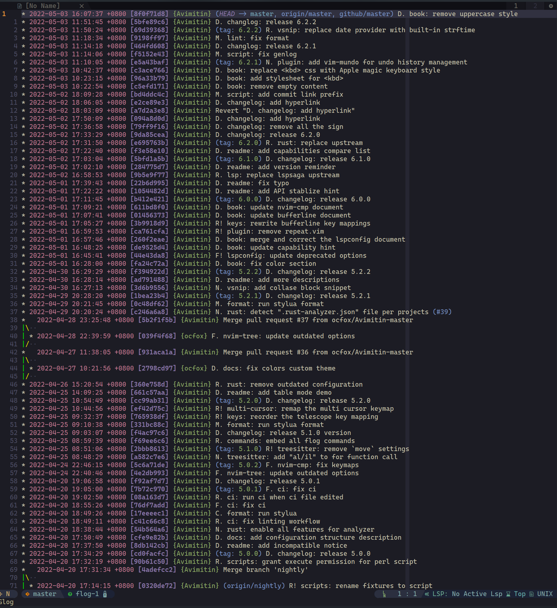

+++
title = '对 commit title 的一些思考'
date  = '2022-01-10'
tag = ['git', 'commit']
author = 'Avimitin'
+++
## 前言

最近对自己的 [commit convention](https://commit-convention.sh1mar.in/)
看得有点烦躁了。
我觉得自己又再次陷入了用一堆问题来解决另一堆问题的困境。

先简单讲讲具体发生了一些什么事情。
以前我一直在用 Angular 的那一套 commit convention。
但是某天当我在写 title 的时候，我发现他们的 type prefix
实在是太长了，长得我只能竭尽脑汁的让 title 里的总结更加精简。

比如下面这个例子，写个 refactor，加上修改的模块名，
我只剩下 25 个字符让我填写 title。有的人可能会说：
“啊你干嘛不直接在后面接着写呢”。这是因为在一般的习惯里，
commit title 都尽量建议缩窄在 50 个拉丁字符里的，方便在大量 log 中检索。
这样在别人 review 的时候就可以一眼明白这个修改大概做了啥。

```text
refactor(module/module): blablablablablabalblablaa
```

我英语不好，我也不想竭尽脑汁高度概括自己的工作，
时间不应该花在这里，“这不是我想要的”。
于是我开始设计自己的 commit convention。

之所以重新设计也要坚持这种 type module summary 的
三明治形式，是因为我认为这种形式能帮助制定版本号
和生成 changelog。从目前的实践来看，这种形式的确
对我制定版本变更有一定的帮助，我甚至可以用很少的
代码就写出一个简单的
[changelog 生成器](https://github.com/Avimitin/changelog_generator)。
这个生成器可以很快的生成出分好类别的版本变更日志。

而我也可以根据不同的类别来增加版本号。
new feature 和 fix 对应 `x.y.z` 里的 patch version。
rewrite 则对应 minor version，带感叹号的对应 major version。

## 设计

经过将近两个月的实践之后，我研究出了一个雅观和简洁好用的
新 prefix。
这套设计与原来的 Commit Convention 相似，保留 prefix `feat/refactor/fix/chore` 的原意，
然后用他们的首字母大写来代替他们。
feat 和 fix 都是 f 开头，所以我用了 N 来代表 feat，
毕竟它的原意是 New Features。具体的设计如下：

```text
<type>[.|!] [module]: <summary>

Example:
N. module: blablabla
F. module: fix blablabla
R! module: rewrite blablabla
```

在这里，感叹号代表 breaking change。为了让 commit 类型对齐，
我稍有冗余的用 `.` 来占位。同时让 module 和符号之间隔开一个
空格。

可能有的人会觉得，为什么不让普通 commit 仅用空格隔开，breaking
用感叹号占位这个空格。我之前也是这样设计的，但用了一段时间之后
我觉得太丑陋了。

```text
R!module: blablabla
F!module: lorem ipsum dolor sit amet
N module: qui minim labore adipisicing
```

这里如果轮换使用空格和感叹号的话，会让 type 和 module 在视觉上产生割裂，
而完全使用符号占位的话将无法直观的分辨出 type 和 module 两个部分。
虽然我实用主义的删掉了累赘的全称 type，但依旧想保留一些看似冗余，
却能提升阅读体验的设计。
所以我选择了符号占位，以及多加一个空格来隔离 type 和 module 两个区域的设计。
不仅只占用三个字符，还可以保护好 reviewer 的眼睛。

## 结果


