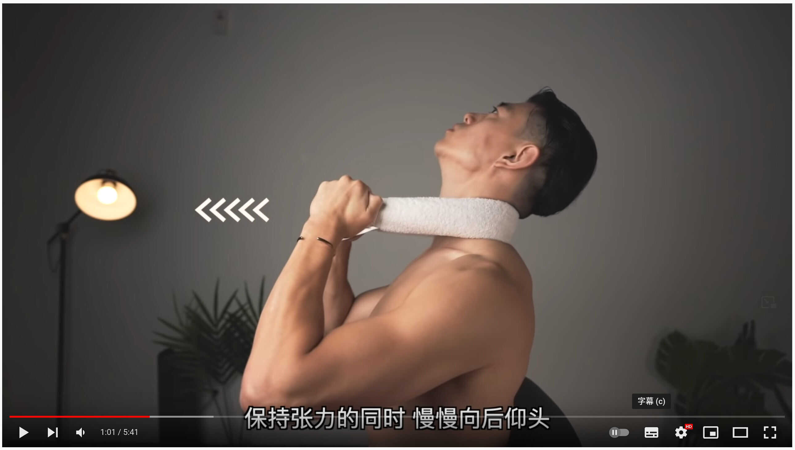
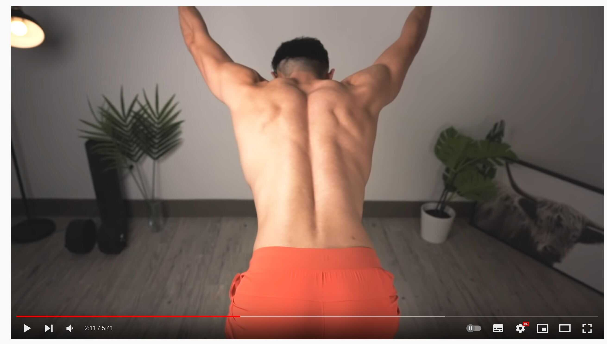
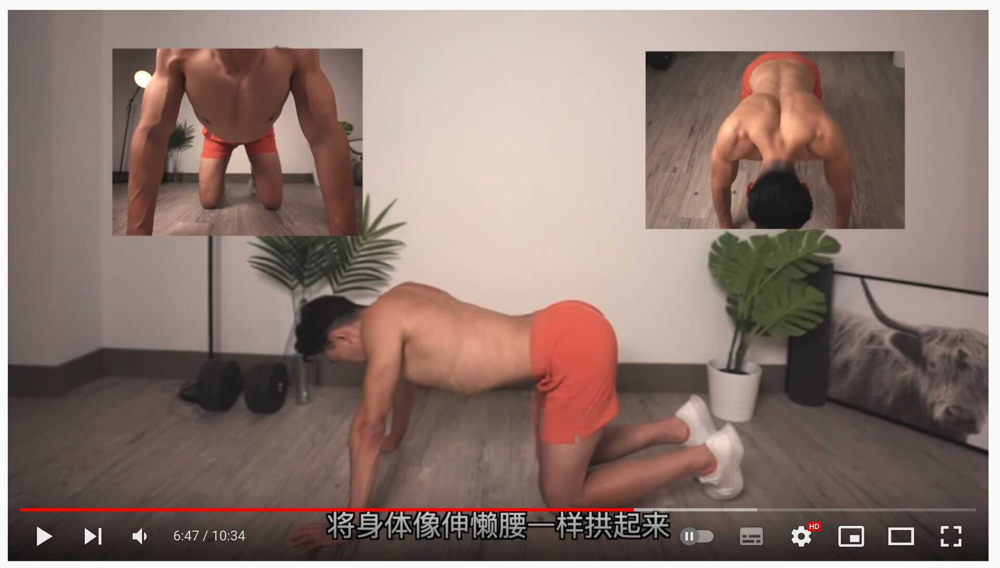
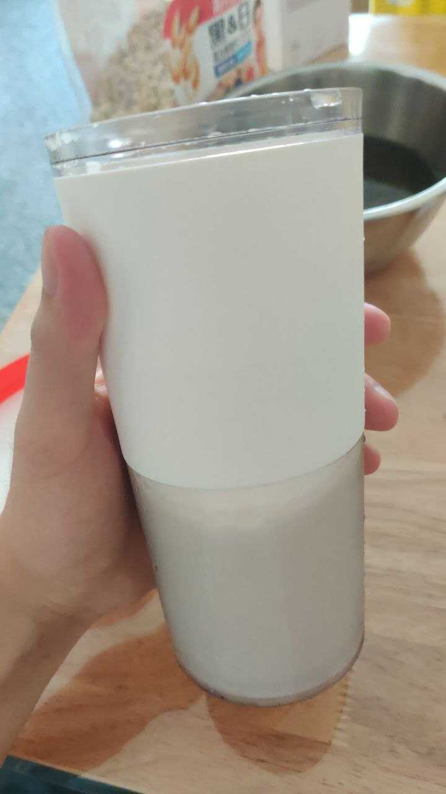
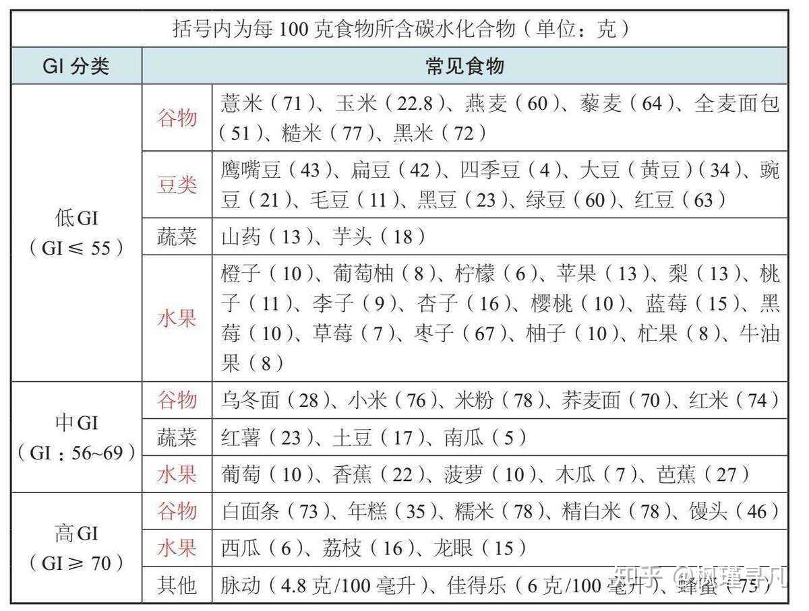

+++
title = '不喝咖啡之后我是怎么解决疲惫的'
date = '2022-07-14'
tag = ['sleep', 'yoga']
author = 'sh1marin'
+++

从大三开始，我每天早上起床第一件事情就是手磨咖啡豆，然后法压一杯咖啡，
靠这点黑色浆液来消除昨天熬夜的疲惫。起初的半年还算有效，但到后面我需要
的浓度越来越高，甚至到了不喝咖啡就整天乏力的状态。

经朋友指点之后才明白，
咖啡因的刺激能提升人的多巴胺分泌，而想要身体有快感需要一个多巴胺的差值。
日常喝咖啡让多巴胺的分泌值始终处于一个高位，而想要获得精神刺激就需要更多
的多巴胺分泌。

为了让多巴胺的阈值回到低位，我把咖啡戒了。但虽说咖啡因坏处多多，我一整天
都没精神，也没有学习的欲望，这样更加糟糕。经过大概半年的学习和实践，我找
到了一套方法来让自己不需要喝咖啡因，也不需要睡满 8 小时，也能充满活力。

## 梗概

总的来说，这套方法主要包括下面三个方面：

- 运动
- 按摩
- 饮食

## 运动

这套方法我是从 YouTube [shuaisoserious](https://www.youtube.com/watch?v=GSvkvzXLlvQ)
那儿学来的。在起床之后，刷牙之前，花五分钟做一套体态纠正，可以迅速让血液在全身流动。
经过两周的实践，我发现这一套动作可以让我很轻松的摆脱刚起床时那种昏昏沉沉的，想立刻
回床上睡觉的眩晕感。

### #1 头部拉伸

找一个毛巾，或者弹力带，将其放在颈部并向前用力拉伸。然后开始前后拉伸你的颈部。

保持 3s 向后仰头的姿势，再保持 3s 向前挤下巴的姿势，就算完成了一轮。
一共做 15 轮即可。

### #2 俯身 ITY 伸展

保持腰部平直，稍微弯曲膝盖，然后向前俯身。伸长手臂，竖起大拇指，拇指朝上。
这组有三个动作需要完成：

1. 手臂放下，然后朝后伸展，高度平行于背部，感受到胸腔被打开，摆出 I 字形，保持 3s。
2. 手臂平直向两边伸展，摆出 T 字形，感受背部中部被挤压的感觉，保持 3s。
3. 手臂放下，然后向斜前方伸展，摆出 Y 字形，感受背部上部被挤压的感觉，保持 3s。

这样就算完成了一轮，一共做 15-20 轮即可。

这个动作需要非常注意，如果感觉到腰酸，说明用力有问题，最好是能站起来缓一会，
重新调整姿势再继续。千万不要用到腰部的力量。

### #3 跪姿靠墙手绕环

单膝跪地，侧面贴近墙面，然后伸展手臂，做顺时针绕环。做 10次即可。

### #4 猫式伸展

双膝跪地，双手和大腿垂直地面，吸气时收缩腹部和肩胛骨，把腰部向上拱起。
保持三秒钟。

然后下沉腰部，把腰向下顶，把屁股翘起来。

做 10 到 15 次即可。

### #5 靠墙伸腰

靠近墙面，两只手伸直并弯曲向墙壁，保持三十秒，再换边。

---

除了早上的日课，晚上下班之后我也会去健身房快走 25 分钟。去不了健身房的日子
就在房间里面跟着 YouTube 的 15 分钟 HIIT 教程燃脂。高强度运动不仅能减肥，
还能帮助睡眠。2020 年疫情刚开始的时候我就在家里摆烂，那个时候真的天天
昏昏沉沉，一天睡十几个小时都困。但后来养成运动的习惯之后就很少有这种疲惫感了
（除了自己作死熬夜）。

## 按摩

睡眠质量本身也很重要，睡不好，睡不够就会很难调度自己的大脑正常工作。

所以我参考了《浓缩睡眠法》这本书。书里讲睡前按摩大脑和眼眶可以帮助提高睡眠质量。
经过一个星期的实践之后，我发现晚上不容易发梦了，书里的这一套对我确实有用。

按摩大脑和眼眶可以缓解脑疲劳。
脑疲劳和身体过度疲劳类似属于慢性疲劳，都有几个特征：

1. 总是觉得身体沉重，大脑反应迟钝。
2. 明明睡了足够长的时间，但还是觉得疲劳没有消除。
3. 早上醒来的第一反应是：“好累啊！”

脑疲劳会使交感神经兴奋，导致人体处于持续紧张状态
和无法放松，影响我们进入深度睡眠。
不解决脑疲劳和睡眠质量，只靠延长睡眠时间并不能解决疲惫的问题，反而会因为
睡眠时间过长导致身体机能降低，变得越发困倦。

### 头部按摩

解决脑疲劳，让大脑放松，可以通过按摩来实现：

- 首先用手掌的掌根，用舒适的力度在耳朵上方的侧头部，用画圈的方式按压 8~10 次。
- 然后用手指头抵在头部侧面按摩放松
- 最后用五根手指头用力在头顶按压画圈，重复 8~10 次。

### 眼部按摩

除了脑疲劳，另一个让我们感觉容易感觉疲惫的就是视疲劳。
视疲劳可以通过毛巾热敷和穴位按摩的方式缓解，但如果你有长期
的眼干，睁不开眼，畏光等症状，强烈建议你去医院诊疗和重新验光。
我去年的时候因为眼睛近视严重，但眼镜度数太浅的缘故，导致
我习惯性贴近屏幕和用力瞪。后来视疲劳严重到每天都无法抑制的揉眼睛，
最后揉出了红眼病，花了不少钱买眼药膏治疗。

- 首先，闭上眼睛，用大拇指轻柔眼球上骨，按压3秒松开3秒，重复3次。
- 其次，用食指、中指、无名指轻柔眼球下骨，也是按压3秒松开3秒，重复3次。
- 最后，用食指、中指、无名指用画圈的方式按压太阳穴，重复6-10次。
- 偶尔还可以用大拇指从耳朵后面的骨头内侧起，沿着后脑勺发际线，一直按压到颈窝（脖子后面中间凹陷的地方）

## 饮食

### 一些要点

晨起摆脱疲劳第一有用的事情，就是起床后马上喝一杯 200ml 以上的白开水。
尽量喝常温的凉白开。一杯凉白开可以让身体机能逐渐恢复。

在看各种视频资料的时候发现，咖啡因可以持续将近 12 小时，所以想要保持
深度睡眠的第二要点，不要在下午饮用任何带咖啡因的饮品。

第三是提前断食时间，尽量在晚上七点前解决晚饭，同时晚饭的量应当尽量减少，
让肠胃在睡前结束消化的工作。

平常饮食应尽量减少高 GI 碳水摄入。我本来是因为健身减肥而尝试中午只吃半碗米饭，
主要靠杂粮来顶肚子。但是改了半个月之后，我发现我不容易下午一直打哈欠想午觉了。
后来看了一些视频介绍才知道，高 GI 碳水，比如白面馒头，面条，米饭这类主食，
容易让血糖迅速升高，这时胰岛素大量分泌，胰脏和肾上腺高强度工作，这个消化的
过程让血液集中于肠胃，大脑便会感到疲惫。

### 我的日常饮食

首先是我的早餐：smoothie。

最早我是在 cbvivi 老师的[平凡料理节目](https://www.bilibili.com/video/BV1o7411K7n2?p=1)
看到的。尝试了几天之后发现好喝又方便，于是每天早上都以一杯 smoothie 加一颗水煮蛋来
当早餐了。现在已经喝了快半年了，真的好喝。

我自己的做法：

- 首先需要准备一个破壁机，或者料理机（但我其实不推荐料理机，我买过一个小米的 500ml 的
便携料理机，刀片太小，而且经常需要充电，不是很方便，有条件还是买破壁机比较好，还能偶尔
打豆浆喝）
- 先倒一杯牛奶，免得粘底，然后加入一勺无糖老酸奶。然后家里有什么水果就切块往里丢，
我不爱吃芒果，所以我通常放苹果或者橙子。
- 最后下三勺或者四勺麦片，看你胃口大小
- 开启机器，打碎，完成！

因为我现在在健身想长肉，所以还会往里加一勺蛋白粉。你也可以适量往里加一些自己喜欢的
配料。但尽量不要放甜品，记住不疲惫饮食的要点：低糖！低糖！低糖！

然后午饭的话，我现在在家，每天叮嘱我妈少油少盐。现在专门买了个不沾锅，炒肉炒菜就基本
不怎么放油。不过这种饮食是因为我广 door 人从小就吃清淡长大，所以能习惯。如果你不习惯的话
我还是建议去淘宝买那种喷壶，不要倒油，用喷壶控制油量，浅浅喷一层来炒菜。
低油之外，就是上面提到的调整主食比例，少吃高 GI 碳水，多吃杂粮。

这里有张图你可以参考：

晚饭我通常只吃水果，吃一个苹果加一个雪梨这样。然后会抓一把花生当零食吃。别的基本没怎么
吃了。
