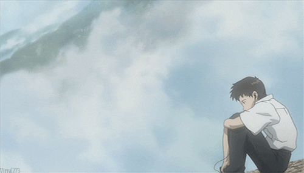
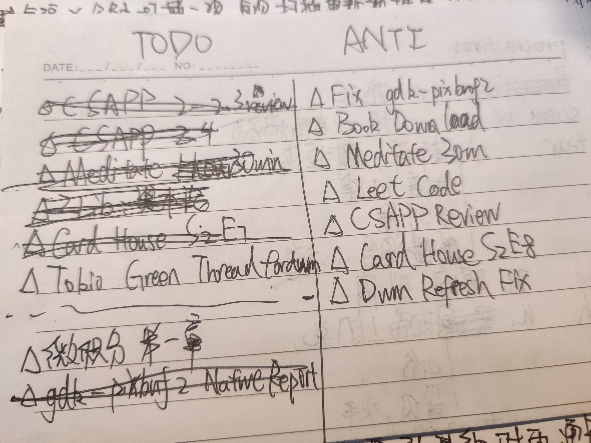

+++
title = '2022 年中忏悔'
date = '2022-05-20'
tag = ['ideology', 'regret']
author = 'sh1marin'
+++
<!-- vim: set tw=80 fo+=t :-->

# 前言

五月将尽，六月将至。眨眼间 2022 已经过去了一大半了。
就在昨天（五月十九日），我终于把毕业论文的终稿给定下来，同时顺利的结束了答辩。
一切都将尘埃落定，我的大学生活也将就此结束了。
即将毕业这一事实给我内心带来了一些触动，以及最近苦于效率很低的状态的现状，
促使着我写下这篇记录文，用来俯瞰和反思自己的 2022 前半年。
希望它能够让我反思自己的前半年的错误，恢复之前的热情和动力，调整状态继续面对下半年的生活。

# 目标完成状态

年初的时候我给自己设立了要多看书和多补文艺作品的目标。
现在回顾一下，完成的量我并不算满意。
四月份补完了《男子高校生的日常》，以及《纸牌屋》的 1-3 季。
五月初把《夏日重现》漫画看完了。小说则只看了渡边淳一的《情人》。

个人身体素质方面，前半年因为疫情的缘故宅在家里，虽然每天都有坚持运动半小时，体重上变化不大，
但明显感觉身体没有以前有力，上下楼梯也开始会喘气。

在计算机方面，经历了两个项目的磨炼之后，我终于算是入门了 Rust。
一个是用手工编辑规则，对分享链接的跟踪参数进行清理的 Telegram Bot。
第二个则是接的 OKEX 的外包，给他们社区写了个反诈骗定时通知机器人。
前一个项目非常简单，就是用正则表达式解析链接，然后再用自定义的正则规则
来匹配跟踪参数并清理，最后重新组成一个干净的链接返回。
第二个项目则是利用 tokio 的 channel 来管理多个 tokio 的 task，实现多任务和定时通知。
除了这两个项目以外，四月截止，我也用 Rust 在 Leetcode 上刷了 45 道每日一题。

三月份到四月份的时候，把 CSAPP 的第二章关于数据的表示学完了，学习进度推进到了汇编的
`jump` 指令。而微积分读本则是一页纸也没看。

前半年搬运烤肉了十多个 YouTube 英文视频，英语听力在这过程中有很大的进步。
我也开始习惯于英文写作，不过语法依旧错漏百出。单词量则是完全没有上升，因为我已经开始偷懒不背单词了。

# 检讨和忏悔

阅读完前半部分会发现，我前半年做的许多事情都是在三月份到四月份完成的。
五月份不仅学习进展停滞，整个人也进入了恶性循环的颓废状态。

在今年三月份，我总结精简了几种 todo 的制定方式，
给自己量身打造了一套制作 todo 的方式。

每天晚上在左边写下明天要做的几个任务，比如看某本书的第某章节，看某个电视剧的第几集。
还有一些琐碎的要在第二天做的小事也记在上面。而在右边写下 "Anti
TODO"，记录下自己今天做了什么，然后用这一列已经被完成的事情来鼓舞自己：
明天要做的更多更好！

这套 todo 方式我坚持了两个月，但到了五月，事情发生了变化。我完全不写 todo
了，我每天行事风格就是想到什么就去做什么。没动力了就不干了，拉倒，我去水群了。
四月份的时候手机使用时间每天最多 1-2 小时，到了五月份每天都超过四个小时！
而我手机上并没有安装什么阅读软件，也没有安装流媒体软件，
五月份我只是单纯浪费在社交软件上，就花去了六分之一的一天！
而这浪费的时间，足够我看完一部老电影，或者看几章的书，再或是多做半小时的有氧运动了。

五月份之后，我也明显感觉自己专注力在持续下降。这大概是因为我开始偷懒不冥想了。
三月份和四月份每天进行半小时的冥想，可以让我一下午都不会蹦出看一眼手机的想法，
而到了五月份，甚至到了今天晚上写博客，我都常常处于五分钟干活十分钟玩手机的状态。

仔细回想一下三月四月和五月我到底发生了什么改变，让我抛弃掉以前的那些好习惯呢？
是熬夜。从十一点睡觉，拖延到十一点半睡觉，到后来带手机上床，凌晨两点才睡觉，
我的睡眠时间越来越少了。在我看来，注意力其实可以当作身体的一块肌肉。
每天的冥想可以锻炼它的健壮程度，而每天充足的睡眠可以让它保持活力。
从五月之后，我既不锻炼注意力这块肌肉，也不让它恢复精力。结果就是到了白天，
我需要它的时候它有力使不出，我也因为注意力分散而被降低了效率。

熬夜给我的第二个负面效果是持续一整天的疲惫。我从五月份之后没有一天是能称得上
元气满满的。每天不是困的要死就是眼睛累得要死。看两三行文字，我的脑袋就开始剧烈疼痛，
眼睛不断打架想睡觉。而我本身注意力不集中，意志力也不强，很快就被更有趣的视频内容，
或者群里的沙雕图吸引走了注意力。

# 改进

打算从今晚开始，不管是睡觉还是平常学习，我就把手机丢到客厅。
然后循序渐进的开始早睡，今晚十一点半，下周十一点，下下周十点半，
让自己身体养成一个不早睡就受不了的习惯。

早睡精力恢复够了，我就能早起，做到早睡之后我就要尽量做到每天早上在六点半或者
七点这个区间起床，起床之后马上刷牙洗脸，做半小时的冥想之后再看手机消息。

鉴于我到晚上就没精打采的现状，我要把看书的时间尽量挪到早上，然后白天完全不摸
任何娱乐媒体，把晚上临睡前的两到三小时用来看电影或者看动画。

最后是要把四月份用得效果很好的 TODO 和 ANTI TODO 法给重新坚持下去。
理清每天需要做什么，合理安排好时间，脑子不乱了做事才有干劲。

# 目标

首先希望下半年能找到一份好工作，然后要在下半年努力把 CSAPP 给完全读完。
除了计算机之外，数学和历史政治这两方面也要开始初步探索，从微积分和资本论这两部分
内容开始，慢慢扩展自己的知识广度。

动画现在有在追《间谍过家家》和《夏日重现》，看完之后再把《星际牛仔》给补了吧。
《纸牌屋》后续的剧情我不是很感兴趣了，也没有什么感兴趣的电视剧，所以下半年可以以
补老电影为主，现在还没有什么特别想看的，之后再去豆瓣查查看。

六月份和七月份要把 Rust Nomicon 看完，让自己有能力写更效率更高的 Rust 代码。
然后要把算法和数据结构重新过一遍，以及坚持写每日一题，方便面试用。

---

最后希望自己，在年底写总结的时候，不要再忏悔和反省了。
每一天都要努力比前一天更好，到年底不能再原地踏步，要看着现在这篇文章，
自信地说我有进步了。
