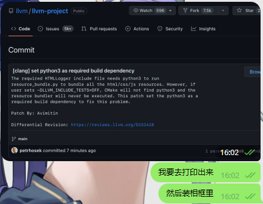

+++
title = 'Using latest LLVM in nix'
date = '2023-06-29'
tag = ['llvm', 'nix']
author = 'sh1marin'
+++

The [vector project](https://github.com/sequencer/vector) is a [RISC-V Vector](https://github.com/riscv/riscv-v-spec)
compliant hardware generator.
They use [Nix](https://nixos.org/) to setup the environment.
In the vector project, they use [buddy-mlir](https://github.com/buddy-compiler/buddy-mlir) to write the test case which required LLVM.
And this post record what problem have I met to just bump the buddy-mlir to the mainline.

## The beginning

A couple of weeks ago, I started to learn in how to integrate the buddy-mlir into the vector project.
Just like other languages, MLIR has a built-in language server (the mlir-lsp-server).
The buddy-mlir project extends it to have RVV Dialect support in a newer commit than the one
vector project currently using. So I decide to bump the buddy-mlir git rev to the latest commit.

This should be a simple copy-paste task right? Well, it is not.
The maintainer of buddy-mlir bumped the LLVM to the mainline in history commit.
And this brings in a massive of dependency hell.

So first thing I need to do is to replace the git rev in buddy-mlir derivation.
It is easy, just replace the `rev` and `hash` attributes:

```diff
# LLVM derivation
-rev = "e31d27e46048ccc3294d6b215dc778b3390e7834";
-hash = "sha256-CM3+amf2SpOiUBzdnO7sryTwmGcC0NVabNNvuatcCDQ=";
+rev = "8f966cedea594d9a91e585e88a80a42c04049e6c";
+hash = "sha256-g2cYk3/iyUvmIG0QCQpYmWj4L2H4znx9KbuA5TvIjrc=";
# buddy-mlir derivation
-rev = "2900b35cfd5ff34e1608b90d04f9dd9f41296f91";
-hash = "sha256-3qduRyjOQKTDRdOpTJirD0Wm14BuvdJLx2IIWHDMD0g=";
+rev = "74c18e6963cf4781be254d3c5d963b36c0642ba4";
+hash = "sha256-Wx/QQrELfOT0h4B8hF9EPZKn4yVHBZeYh3Wm85Jpq60=";
```

And it was built successfully. But after I created a GitHub PR for the vector project,
I noticed that almost all the tests failed with an error:

```text
*.mlir.S:3:16: error: invalid arch name 'rv32i2p1_m2p0_f2p2_d2p2_v1p0_zicsr2p0_zve32f1p0_zve32x1p0_zve64d1p0_zve64f1p0_zve64x1p0_zvl128b1p0_zvl32b1p0_zvl64b1p0', unsupported version number 2.1 for extension 'i'
 .attribute 5, "rv32i2p1_m2p0_f2p2_d2p2_v1p0_zicsr2p0_zve32f1p0_zve32x1p0_zve64d1p0_zve64f1p0_zve64x1p0_zvl128b1p0_zvl32b1p0_zvl64b1p0"
               ^
*rvv-vp-intrinsic-add*.mlir.S:13:2: error: instruction requires the following: 'V' (Vector Extension for Application Processors), 'Zve32x' or 'Zve64x' (Vector Extensions for Embedded Processors)
 vsetivli zero, 16, e32, m4, ta, ma
 ^
```

After discussing this with my teammates and mentor, we came up with a possible reason:
the llvm used by buddy-mlir is compatible with the execution environment.
The vector repo  has a customi clang using llvm14 for the riscv 32bit environment. There must be a lot of changes since the llvm 14 to the mainline.
I tried to replace the `llvmPackage_14` with `llvmPackages16`, but the problem is not solved. 
I need to dig deeper into the problem deeper.

First I need to find out what the error message means.
What does "unsupported version number 2.1 for extension 'i'" mean? 
Reading the message letter by letter, I found that the generated assembly code has an attribute `rv32i2p1_.....`,
which indicates that the target architecture uses riscv i extension version 2.1.
This `.mlir.S` file [is generated](https://github.com/sequencer/vector/blob/abf222c57576cea1bd4776960e562367930bf6d7/build.sc#L520-L526) by the `buddy-llc` tool.
As this error is prompted when converting assembly code into machine code,
it means that the assembler in execution environment is incompatible with the assembly code generated by buddy-mlir.
Searching through the llvm repository, we find that the extension version support is hard-coded in the
[llvm/lib/Support/RISCVISAInfo.cpp file](https://github.com/llvm/llvm-project/blob/ac1b69b9db5ceaba1d168de47509ab4cf190a93c/llvm/lib/Support/RISCVISAInfo.cpp#L59).
And the `i` extension version 2.1 support is not in
[llvm14](https://github.com/llvm/llvm-project/blob/f28c006a5895fc0e329fe15fead81e37457cb1d1/llvm/lib/Support/RISCVISAInfo.cpp#L43),
[llvm16](https://github.com/llvm/llvm-project/blob/7cbf1a2591520c2491aa35339f227775f4d3adf6/llvm/lib/Support/RISCVISAInfo.cpp#L43),
or even [llvm17 pre-release](https://github.com/llvm/llvm-project/blob/603c286334b07f568d39f6706c848f576914f323/llvm/lib/Support/RISCVISAInfo.cpp#L43).
This means that I have to replace the whole toolchain to the latest llvm.

## The Nix magic

The nixpkgs have llvmPackages_16 provided, so it is redundant to re-packaged the llvm derivation myself.
And nixpkgs also provides simple way to override the download source.
We can pass in `gitRelease` attribute set or `officialRelease` attribute set to replace the source.

```nix
# ...
# LLVM release information; specify one of these but not both:
, gitRelease ? null
  # i.e.:
  # {
  #   version = /* i.e. "15.0.0" */;
  #   rev = /* commit SHA */;
  #   rev-version = /* human readable version; i.e. "unstable-2022-26-07" */;
  #   sha256 = /* checksum for this release, can omit if specifying your own `monorepoSrc` */;
  # }
, officialRelease ? { version = "16.0.6"; sha256 = "sha256-fspqSReX+VD+Nl/Cfq+tDcdPtnQPV1IRopNDfd5VtUs="; }
  # i.e.:
  # {
  #   version = /* i.e. "15.0.0" */;
  #   candidate = /* optional; if specified, should be: "rcN" */
  #   sha256 = /* checksum for this release, can omit if specifying your own `monorepoSrc` */;
  # }
 # ...
```

It is set to 16.0.6 from GitHub Archive by default, but we can set the `officialRelease` to null
and pass in `gitRelease` attribute to let the llvmPackage use the latest llvm source.

```nix
llvmPackages_16.override {
   gitRelease = {
     version = "17.0.0";
     rev = "8f966cedea594d9a91e585e88a80a42c04049e6c";
     rev-version = "unstable-2023-05-02";
     sha256 = "sha256-g2cYk3/iyUvmIG0QCQpYmWj4L2H4znx9KbuA5TvIjrc=";
   };
   officialRelease = null;
}
```

Nixpkgs contains some custom patches that needed to be applied to LLVM.
And the LLVM mainline contains many breaking changes that I need to fix in the original patch.
These patches are used in the `libllvm` attribute in the `llvmPackages_16` set.
And the `llvmPackage_16` is a huge set of attributes containing several llvm tools and libraries.
There is no conventional `overrideAttrs` to change any part of it.
This confused me for a long time until Sharzy told me that [the correct way](https://nixos.wiki/wiki/Overlays#Overriding_a_package_inside_an_extensible_attribute_set) is to `extend` it.

```nix
myLLVM = (llvmPackages_16.override {
  gitRelease = {
    version = "17.0.0";
    rev = "8f966cedea594d9a91e585e88a80a42c04049e6c";
    rev-version = "unstable-2023-05-02";
    sha256 = "sha256-g2cYk3/iyUvmIG0QCQpYmWj4L2H4znx9KbuA5TvIjrc=";
  };
  officialRelease = null;
}).extend (lfinal: lprev: {
  llvm = lprev.llvm.overrideAttrs (oldAttrs: {
    patches = (builtins.filter (p: builtins.baseNameOf p != "gnu-install-dirs.patch") oldAttrs.patches) ++ [
      ./nix/gnu-install-dirs.patch
    ];
  });
});
```

The code example above is hard to understand the first time you read it, right?
And if you have never written functional programming language, it will be ever harder to understand.
So what it does is to pass a function into the `extend` attribute.
The function takes two arguments: the `lfinal` argument, which represents the state after overriding,
and the `lprev` argument represents the state before the override.
The function returns an attribute set with the `llvm` field.
This attribute set will eventually replace the original `llvm` field declare in `llvmPackages_16`.
The `llvm` attribute set in `llvmPackages_16` allows overriding attributes,
so the next step is to pass a function with the `oldAttrs` argument to the `overrideAttrs` function.
Finally, I can start modifing the `patches` attr for `llvm`. The `filter` function will filter out the `gnu-install-dirs.patch` file
and replace it with my updated patch.

So, this is the end right? No, not yet! I am still far from a successful build.
Nix even fail to evaluate the derivation in flake.nix:

```text
error: attribute 'stdenv' missing

at /nix/store/some-hash-path/flake.nix:

devShell = pkgs.mkShell.override { stdenv = pkg.myLLVM.stdenv; }
                                                       ^
```

`stdenv` is a package that contains necessary build tools and library to build a basic package with makefile or other build system.
The stdenv provided in llvmPackages has complete build tools for building the LLVM project,
which is required for the vector repository development.

Why is it missing? This is because the indentation f**k up.
I don't know the llvmPackages_16 is actually a set with the following hierachy:

```nix
let
  tools = lib.makeExtensible ( ... )
  libraries = lib.makeExtensible ( ... )
in
  { inherit tools libraries release_version; }
```

The `lib.makeExtensible` function will add `extend` attrs to the given set.
And because of `llvmPackages_16`, with both `tools` and `library` sets inherit,
when I call the `llvmPackages_16.extend` function, it is actually calls the `llvmPackages_16.tools.extend` function.
Because the `extend` function will only return the modified set it is in, so after I called the `llvmPackages_16.extend` function,
there is only `llvmPackages_16.tools` attr set left, no more `libraries` set. And coincidently, the `stdenv` set came
from `libraries` set. That's why the error occurs.

This is an internal bug of nixpkgs. But since `stdenv` is just a basic build environment,
we can use the old `stdenv` in the unmodified version of the `llvmPackage`.

The overriden `llvmPackages_16` package was successfully built, but the patch still mismatches when I build clang.
And a confusing problem arise: the `patch.rej` shows that I am applying the new patch to the old sources!
This is because the `llvm` attr in `llvmPackages_16` is just an alias for the `libllvm`.

```nix
libllvm = callPackage ./llvm {
  inherit llvm_meta;
};

llvm = tools.libllvm;
```

However `clang` uses the `libllvm` attr, so when clang builds, it will try to apply the new patch to the old sources.
So the correct way is to extend the `libllvm` attrs.

## My First LLVM contribution

There is also a story when I try to build clang.
In the llvm mainline, they force the `llvm-gtest` build target when you set `LLVM_INCLUDE_TESTS=ON`.
However if I set `LLVM_INCLUDE_TESTS=OFF`, the build process still fails.

```text
/build/.../clang/lib/Analysis/FlowSensitive/HTMLLogger.cpp: fatal error: HTMLLogger.inc: No such file or directory
```

The HTMLLogger.inc file is a bunch of HTML/JS/CSS code wrapped in `char[]` to be used at runtime to generate web logger.
It is generated by a bundler script written in Python. It is wrapped in the `add_custom_command` function
provided by CMake, and is executed at build time.

```cmake
add_custom_command(OUTPUT HTMLLogger.inc
  COMMAND "${Python3_EXECUTABLE}" ${CLANG_SOURCE_DIR}/utils/bundle_resources.py
  ${CMAKE_CURRENT_BINARY_DIR}/HTMLLogger.inc
  HTMLLogger.html HTMLLogger.css HTMLLogger.js
  WORKING_DIRECTORY ${CMAKE_CURRENT_SOURCE_DIR}
  COMMENT "Bundling HTMLLogger resources"
  DEPENDS ${CLANG_SOURCE_DIR}/utils/bundle_resources.py HTMLLogger.html HTMLLogger.css HTMLLogger.js
  VERBATIM)
```

There must be some error logging during the build time, I thought. But I cannot find any.
I also tried adding more verbose logging, thinking that the stdout/stderr might be captured by CMake.
But it was still as silent as the wilderness, and I could not see a message.
So I tried to verify that the bundle script was actually running.
To avoid the possibility of stdout/stderr being captured by the parent process,
I add a logging to file script snippet to the bundler. And there is no such logging file exist.

Why isn't bundler script running? I opened up the `build.ninja` file and found out why:

```ninja
build lib/Analysis/FlowSensitive/HTMLLogger.inc | ...: CUSTOM_COMMAND ...
  COMMAND = cd /build/clang-src-unstable-2023-05-02/clang/lib/Analysis/FlowSensitive
  DESC = Bundling HTMLLogger resources
  restat = 1
```

There is only a `cd` command left in the `COMMAND`!
This shouldn't be a bug in ninja, as it generated other build commands correctly.
So I add a debug logging to the CMakefile, and find that the Python interpreter is missing!
The `"${Python3_EXECUTABLE}"` variable has no value.

But why? If this is a runtime component, then if I missing python3 is missing, the configure process must fail before I can start the build.
Searching through the `CMakelist.txt` files, I finally come to the core problem. In clang CMakefile, it only finds python3 executable
when `LLVM_INCLUDE_TESTS=ON`. So if I set the option to off, configure process will pass, but the `Python3_EXECUTABLE` variable will not be set.
Since ninja gets an empty string as command, it doesn't generate the actual build command and just leaves `cd`.

So I send a patch to llvm to fix the issue and get my first LLVM contribution: <https://reviews.llvm.org/D152418>.

> My reaction `:)`
> 

## It compiles, but it does not work

I am exhausted, but the challenge continues. After I finally compiling all the whole thing successfully and entering the devshell,
I found that the lld was broken:

```text
error while loding shared libraries: libLLVM-17git.so: cannot open object: no such file or directory
```

The shared library is built correctly and placed in the correct path, so there must be something wrong in the lld rpath.
I didn't suffer much with the help from NickCao, who found LLVM introduces a [breaking change](https://github.com/llvm/llvm-project/commit/8f833f88ab78265a8e0ebb0d1522771d67c708a9#diff-f60dae8e82f67fa5e534e9ea566430d5b79f36119020865dc37b95d9a3635c5eL2357-R2364)
when installing build tools. In preFixup stage, CMake set runtime path:

```text
lld-unstable> -- Set runtime path of "/nix/store/qm4w9bxjc6xiixrbdrdzjxgr487yphx7-lld-unstable-2023-05-02/bin/lld" to "$ORIGIN/..//nix/store/5l99zwgmjiynkpb6p4hmqndssz41q98i-lld-unstable-2023-05-02-lib/lib"
```

So I [add a patch](https://github.com/sequencer/vector/commit/31488a03e3534971bb8e8dfe83801b4b2eb44711#diff-f9ef770a28e5abac1184edc7fce5682df60d98d4982f6502f14513761a0350ecR59-R68)
to remove the changes.

And after the clang work, spike failed to build.

```text
/nix/store/shw0b6wv2xdvyj71b1fj147i83awrqfz-binutils-2.40/bin/ld: /nix/store/kf147vkmb7a7z17lkpgj2d6y7w75nf7v-gcc-12.2.0//lib/libatomic.a(glfree.o): relocation R_X86_64_32S against `.rodata' can not be used when making a PIE object; recompile with -fPIE
/nix/store/shw0b6wv2xdvyj71b1fj147i83awrqfz-binutils-2.40/bin/ld: failed to set dynamic section sizes: bad value
clang-16: error: linker command failed with exit code 1 (use -v to see invocation)
```

This is because the `ld` executable in the provided `stdenv` is not compatible with the latest LLVM.
After discussion with the teammates, we decide to keep the `llvmPackages_14` toolchain in devshell,
and add a script called `clang-rv32` as wrapper to use clang in the latest LLVM.
And there it is, the final working version: <https://github.com/sequencer/vector/pull/230>.
