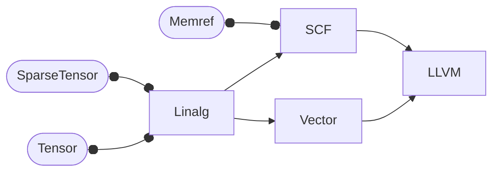

+++
title = 'Sparse Compiler'
date = '2023-05-26'
tag = ['mlir']
author = 'sh1marin'
+++

除了前一篇文章提到的 List of list 结构，还有如 Coodinate format, Compress Sparse Row/Column，
Diagonal 等数据结构，这些结构虽然设计上大有不同，但理念上是一样的：
一个只存数据的主存储，和一个额外的，辅助索引的坐标存储。每一种存储格式都是相当重要且
在特定的 case 中能发挥出最优的性能的。因此如何选择适合自己的 Case 的存储结构，
在特定的时机下转换存储结构，以及实现相对应的操作，会带来繁杂的工程量和许多隐藏的 BUG。
这导致了很多开发者实际上会对着自己的项目为调用的库做优化，但这并不能解决问题，甚至
会在数据结构变化的时候引入更差的性能瓶颈。

于是这里需要引入一个 Sparse Compiler 的概念。
这是一种把 Sparsity 当作一种属性，而不是大量繁复的实现代码的思路。
使用 sparse compiler，用户就可以只输入对 sparsity 的描述，生成一系列对稀疏存储的实现和操作。
每个稀疏实现都是为同一问题的具体实例量身定做的，比如 tensor 将会在不同场景下使用不同的数据结构。
这种自动方法不仅使非专业程序员能够快速生成稀疏代码，而且使专业程序员能够探索可能的稀疏实现的全部空间。

这种概念最早是在 1996 年由 Aart Bik 用 Fortran 实现的
名叫 MT1 https://www.aartbik.com/sparse.php 的 sparse compiler 上实现的。
之后由斯坦福大学的 Fredrik 教授和一群 MIT 的 CSAIL 实验室的成员合作开发的
TACO (Tensor Algebra Compiler) 上，将 sparse compiler 的实现正式化并推广。
Aart Bik 领头开发了 MLIR 的 sparse tensor 实现，他在研究如何为 MLIR 实现 sparse compiler
时发现 TACO 的实现更加严谨优雅，于是最后 MLIR 这边采用了 TACO 的设计。

## MLIR

在 MLIR 里，存在着许多 Dialect，每个 Dialect 都会定义一些类型，操作，还有属性。
Dialect之间负责的功能不同，也有着不同层级的抽象。
高抽象层级的 Dialect 会一步一步 lower 到低抽象层级的 Dialect。
比如将高度抽象的，并不涉及内存表示的 tensor 类型 lower 到底层级的 memref 类型。
这种在合适的抽象层次执行操作的理念，和 sparse compiler 将稀疏性当作一种属性的概念是非常匹配的。

MLIR 是如何实现 Sparse 的呢？MLIR 实现了 `sparse_tensor` 这个 Dialect。
这个 Dialect 更像是一个胶水一样的产物，利用原有的实现而不是重新引入新的语义和实现。 
它提供了与稀疏相关的类型和属性，而操作代码则由 Linalg Dialect 提供。
Linalg Dialect 之后将分解 lower 到 scf Dialect，生成一系列 for，while，if 的循环操作。
以及 memref Dialect 来表达底层的内存缓存读写操作。
sparse_tensor 也可以由 linalg Dialect lower 到 vector Dialect，这是一个平台中立的向量操作 Dialect，
其最终会被 lower 到平台特定的 SIMD 指令。



具体实现而言，tensor 类型支持在类型定义时加上编码属性，比如 `tensor<0x3xf64, #ATTR>`，
因此将一个普通的 tensor 变成一个 sparse 的 tensor 只需要创建一个描述稀疏性的属性，并
传递给这个 tensor 即可。

sparse_tensor Dialect 提供了 `sparse_tensor.encoding` 用来定义三个稀疏属性

1. 对每一个维度的稀疏程度的描述（ "dense", "compressed", "singleton" ）
2. 对维度的排序的描述
3. 指针和索引的位宽 (8-64 bit，可以用来减少部分开销)

```mlir
#DCSC = #sparse_tensor.encoding<{
  lvlTypes = [ "compressed", "compressed" ],
  dimOrdering = affine_map<(i, j) -> (j, i)>,
  posWidth = 32,
  crdWidth = 8
}>
... tensor<8x8xf64, #DCSC> ...
```

使用 sparse tensor encode 之后的 tensor 就不再像 dense 的 tensor 那样在 bufferization 的过程
中直接用 memref 来 buffer 了，而将被 lower 到一个更紧凑的存储结构上。这个结构由三个数组组成。
其中，一个二维数组 indices，用来指明非零元素的具体索引，其每个元素代表着 tensor 的某一维度。
比如当我们要访问第一维度的非零元素的索引时，则使用 `indice[0]` 来读取。
还有一个二维数组 pointers，和 indices 一样，它的每个元素也代表着 tensor 的维度，而内部数组
用来指明非零元素可读取的范围。
最后是一个一维数组，只用来存放非零的值。

因为设定一个 tensor 是 sparse 的只需要添加新的属性就行，所以原本的比如像

```mlir
%C = linalg.matmul ins(%A, %B: tensor<?x?xf64>, tensor<?x?xf64>) -> tensor<?x?xf64>
```

都可以简单的加个 sparse 属性变成对 sparse tensor 的操作

```mlir
%C = linalg.matmul ins(%A, %B: tensor<?x?xf64, #CSR>, tensor<?x?xf64, #CSR>) -> tensor<?x?xf64, #CSR>
```

除此之外 sparse_tensor 这个 Dialect 本身也提供一些操作，主要分三类

* 用来生成 sparse tensor 的

比如 `sparse_tensor.new`，可以从指定的文件名读取一个特定 Matrix Market Exchange 格式的文件
然后把它转换成内部的 tensor 类型。

* 用来转换 sparse tensor 的

MLIR 是强类型的，所以一切的类型转换都需要显示的表达，sparse_tensor 提供了
`sparse_tensor.convert` 操作用来转换 tensor 的类型

`%to = sparse_tensor.convert %from : tensor<10x10xf64, #CSR> to tensor<10x10xf64, #CSC>`

这里是一个将 #CSR 属性的 tensor 转换到 #CSC 属性的操作。

除此之外，convert 操作还可以将 dense tensor 转换到 sparse tensor。比如这里用

```mlir
%m = arith.constant sparse<[[0,0], [3,2], [4,6]], [1.0, 3.0, 5.0]> : tensor<5x7xf64>
%s = sparse_tensor.convert %m : tensor<5x7xf64> to tensor <5x7xf64, #CSR>
```

声明 %m 是一个 Coodinate list 的结构，5x7 的密集矩阵。
第一个数组记录行列值，第二个数组记录非零的值。
然后使用 sparse_tensor.convert 操作把它转换到了 #CSR 结构的 sparse tensor.

* 用来支持 lower 的

最后，Sparse Tensor Dialect 还提供了一些用于帮助 lowering 到其他 Dialect 的操作，
首先从加上了属性的 Tensor lower 到只存储和遍历非零元素的中间形式，
然后再从这个中间形式 lower 到具有实际存储方案的 buffer 形式，
最后再到运行在目标硬件上的可执行代码。

```mlir
%ind = sparse_tensor.indices %t, %c3 : tensor<10x10xf64, #SparseTensor> to memref<?xindex>
```

### Sparse Tensor 的优化

在 MLIR 中，Sparse Compiler 的实现是靠一组在 Sparse Tensor Dialect 里在 lowering 时加入的优化实现的。
像上述提到的对 Sparse 存储的操作，组合和转换 Sparse 存储，遍历非零元素
以及用并行和向量化来优化执行效率等等，都是靠这些优化实现的。

比方说我们要实现一个简单的对向量每个元素做乘积运算的操作，即 `V[i] *= x`。
这个操作在output中把向量作为参数，但还接受了一个特殊的 block，在 block 里单独写了乘法计算。
使用 sparse_tensor Dialect 提供的优化之后，这个 Linalg 操作会走一个特殊的魔法 transform
改写成 sparse 操作相关的 scf 的 mlir 代码。
