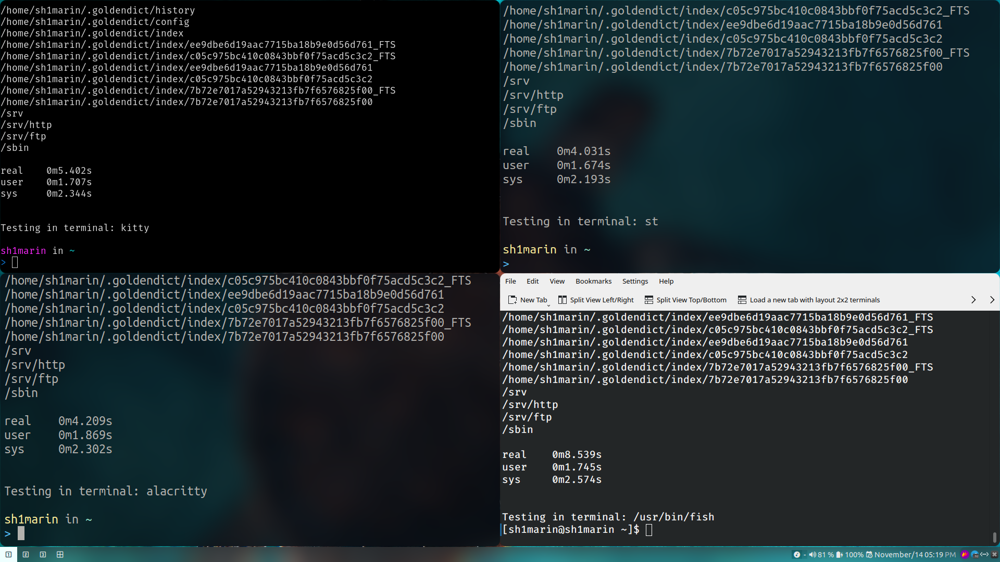

## 前言

今天学到了一个新的知识：终端的绘制性能会影响程序的性能。当一个程序以单线程
运行时，终端输出和 IO 都在同一个线程，终端如果绘制速度慢，因为 IO 是阻塞的
，程序内部的 stdout 执行速度也会下降。

## 测试

那么有什么办法可以测试一下哪些终端绘制速度比较快呢？我在 Rust CN 群看到的这
么个办法：用高频率 IO 和输入输出来测试。那么只需要用 shell 提供的 time 方法
来测试就行。有一个最高频 IO 的方式是用 find 来遍历系统内所有文件，同时 find
毎找到一个文件都会输出一次。所以这里我们只需要简单的 `time find /` 即可。

为了比对各个终端，我做了一些额外工作来获取终端的名字。具体脚本如下：

```bash
#!/bin/bash

get_terminal() {
  PARENT_SHELL=$(ps -p $$ -o ppid=)
  PARENT_TERMINAL=$(ps -p $PARENT_SHELL -o ppid=)
  TERMINAL=$(ps -p $PARENT_TERMINAL o args=)
  printf $TERMINAL
}

echo "TESTING find /"
sleep 0.5
echo
time find /
echo -e "\n\nTesting in terminal: $(get_terminal)"
```

## 结果



其中 Alacritty 和 simple terminal 打得不相上下，而 kitty 稍逊一筹，konsole
（右下） 是最慢的。后续我再比对了几次也是一样的结果。

## 链接

- Alacritty: https://alacritty.org/
- Simple Terminal: https://st.suckless.org/
